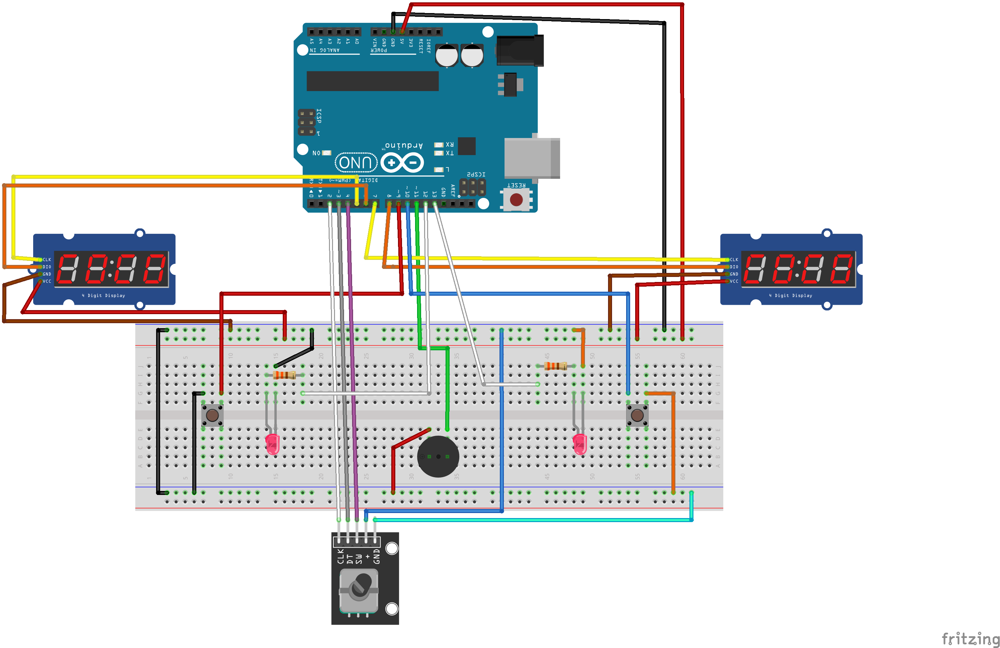

# BlueStamp Chess Clock
My project is a chess clock made with an Arduino, two 4-digit displays, a rotary encoder, and push buttons. You can customize your game time and time gained from each move before starting a match, creating a fully working chess timer. My biggest challenges were debugging the rotary encoder and adding the increment feature, but solving these problems gave me more experience about electronics, programming, and debugging.

```HTML 
<!--- This is an HTML comment in Markdown -->
<!--- Anything between these symbols will not render on the published site -->
```

| **Engineer** | **School** | **Area of Interest** | **Grade** |
|:--:|:--:|:--:|:--:|
| James C | Herricks High School | Engineering (not sure rn) | Incoming Junior

**Replace the BlueStamp logo below with an image of yourself and your completed project. Follow the guide [here](https://tomcam.github.io/least-github-pages/adding-images-github-pages-site.html) if you need help.**


  
# Final Milestone

<iframe width="560" height="315" src="https://www.youtube.com/embed/o86_V3mbhnM?si=aqIzj0LZF1ro0A1b" title="YouTube video player" frameborder="0" allow="accelerometer; autoplay; clipboard-write; encrypted-media; gyroscope; picture-in-picture; web-share" referrerpolicy="strict-origin-when-cross-origin" allowfullscreen></iframe>

For my final milestone, I completed my chess clock project and made several improvements and modifications beyond the original base project. I added the ability to set a custom increment for each player and continued testing the project to make sure everything worked correctly. Throughout this process, I spent a lot of time debugging and making small changes to improve the overall chess clock. The biggest challenge I faced was implementing the increment feature because the timer continuously recalculated the elapsed time, so I had to change how the extra time was stored and displayed. Another challenge was solving the debounce issue with the rotary encoder. I learned about quadrature decoding and how tracking the encoder's sequence of signals made the controls much more accurate and prevented skipped values and bouncing.
Overall, I learned a lot about both hardware and software, including wiring components on a breadboard, reading and modifying C++ code, and debugging problems along the way. After everything I learned at BSE, I hope to continue improving my programming and electronics skills and maybe continue more projects and learning more about robotics.


# Second Milestone

<iframe width="560" height="315" src="https://www.youtube.com/embed/cUcmcce_FP8?si=eCHiTjRAY7oR4T_x" title="YouTube video player" frameborder="0" allow="accelerometer; autoplay; clipboard-write; encrypted-media; gyroscope; picture-in-picture; web-share" referrerpolicy="strict-origin-when-cross-origin" allowfullscreen></iframe>

For my second milestone, I completed the base code for my project. This part was difficult because I had never worked with C++ before. However, I had a bit of experience with Java which helped me understand some of the programming concepts easier. One challenge I had was a debounce issue with the rotary encoder, which took quite a while to understand and code a solution but with the help of my instructor, I was eventually able to debug the issue and successfully fix it. For my final milestone, I plan to make additional modifications and improvements now that the base project is done. I hope to also continue improving the overall project of the chess clock.

# First Milestone

<iframe width="560" height="315" src="https://www.youtube.com/embed/fApPMsWDlFM?si=QODlaHQl--UL4WQF" title="YouTube video player" frameborder="0" allow="accelerometer; autoplay; clipboard-write; encrypted-media; gyroscope; picture-in-picture; web-share" referrerpolicy="strict-origin-when-cross-origin" allowfullscreen></iframe>


My project is a chess clock/timer. For my first milestone, my main goal was to build the physical structure of the chess clock. Because of this, most of my time was focused on the hardware part of the project. I was able to set up the required parts and connect the needed wires. One challenge I faced was accidentally mixing up the active and passive buzzers but I was able to spot it quickly. The biggest part of this milestone was connecting and organizing all of the wiring. Since this was my first time working with a breadboard, I had to learn how to connect components correctly while making sure everything was wired correctly and preventing possible issues like short circuits. Another challenge was managing the large number of wires, which initially made the setup look messy and a little hard to follow. To improve the organization, I rearranged the wires and placed them in better fit positions, making the project easier to understand. For the second milestone, I plan to add the code and begin testing the chess clock to ensure that all of the hardware and software components work properly.

# Schematics 
Here's where you'll put images of your schematics. [Tinkercad](https://www.tinkercad.com/blog/official-guide-to-tinkercad-circuits) and [Fritzing](https://fritzing.org/learning/) are both great resoruces to create professional schematic diagrams, though BSE recommends Tinkercad becuase it can be done easily and for free in the browser. 


# Code
Code for the Chess clock

```c++
#include <TM1637Display.h>

//encoder
#define outputA 2
#define outputB 3
#define enSw 4

// 4-digit display pins
#define CLKA 5
#define DIOA 6
#define CLKB 7
#define DIOB 8
TM1637Display displayA(CLKA, DIOA);
TM1637Display displayB(CLKB, DIOB);

//button, led, buzzer
#define btA 9
#define btB 10
#define buzz 11
#define ledA 12
#define ledB 13

uint8_t segOff[] = {false, false};

int modeState = 0;

unsigned long incrementSecA = 0; //player gains a certain amount of time each time they move
unsigned long incrementSecB = 0;
unsigned long incrementTimeA = 0;
unsigned long incrementTimeB = 0;
unsigned long minSetA = 5;
unsigned long secSetA = 0;
unsigned long minSetB = 5;
unsigned long secSetB = 0;
unsigned long timeO = 0;
unsigned long timeA = 0;
unsigned long timeB = 0;
int enSwStatus = 1;
int enSwStatusLast = 1;
int btAStatus = 1;
int btAStatusLast = 1;
int btBStatus = 1;
int btBStatusLast = 1;

// ---- quadrature decoder state ----
uint8_t encPrevState;
int8_t encSteps = 0;
const int8_t encDir[16] = {0,-1,1,0, 1,0,0,-1, -1,0,0,1, 0,1,-1,0};

// Returns +1 for one CW detent, -1 for one CCW detent, 0 otherwise.
int8_t readEncoder() {
  uint8_t s = (digitalRead(outputA) << 1) | digitalRead(outputB);
  if (s != encPrevState) {
    encSteps += encDir[(encPrevState << 2) | s];
    encPrevState = s;
    if (encSteps >= 4)  { encSteps = 0; return  1; }
    if (encSteps <= -4) { encSteps = 0; return -1; }
  }
  return 0;
}
// ----------------------------------

void setup() {
  Serial.begin(9600);

  displayA.setBrightness(4);
  displayA.clear();
  displayB.setBrightness(4);
  displayB.clear();
  delay(1000);

  pinMode(btA, INPUT_PULLUP);
  pinMode(btB, INPUT_PULLUP);
  pinMode(buzz, OUTPUT);
  pinMode(ledA, OUTPUT);
  pinMode(ledB, OUTPUT);

  pinMode(outputA, INPUT_PULLUP);   // was INPUT — pins were floating!
  pinMode(outputB, INPUT_PULLUP);
  pinMode(enSw, INPUT_PULLUP);

  encPrevState = (digitalRead(outputA) << 1) | digitalRead(outputB);
  digitalWrite(buzz, LOW);
}

void loop() {
  switch (modeState) {

    case 0:
      digitalWrite(buzz, LOW);
      digitalWrite(ledA, LOW);
      digitalWrite(ledB, LOW);
      displayA.showNumberDecEx(minSetA*100 + secSetA, 0b01000000, true, 4, 0);
      displayB.showNumberDecEx(minSetB*100 + secSetB, 0b01000000, true, 4, 0);
      enSwStatus = digitalRead(enSw);
      btAStatus = digitalRead(btA);
      btBStatus = digitalRead(btB);
      if (enSwStatus==0 && enSwStatusLast==1) modeState = 1;
      if (btAStatus==0 && btAStatusLast==1) { modeState=12; timeO=millis(); timeA=0; timeB=0; incrementTimeA=0; incrementTimeB=0; }
      if (btBStatus==0 && btBStatusLast==1) { modeState=11; timeO=millis(); timeA=0; timeB=0; incrementTimeA=0; incrementTimeB=0; }
      btAStatusLast = btAStatus;
      btBStatusLast = btBStatus;
      enSwStatusLast = enSwStatus;
      break;

    case 1:
      enSwStatus = digitalRead(enSw);
      minSetA = setNum(minSetA);
      displayBlink("A", 0);
      if (enSwStatus==0 && enSwStatusLast==1) modeState = 2;
      enSwStatusLast = enSwStatus;
      break;
    case 2:
      enSwStatus = digitalRead(enSw);
      secSetA = setNum(secSetA);
      displayBlink("A", 2);
      if (enSwStatus==0 && enSwStatusLast==1) modeState = 3;
      enSwStatusLast = enSwStatus;
      break;
    case 3:
      enSwStatus = digitalRead(enSw);
      minSetB = setNum(minSetB);
      displayBlink("B", 0);
      if (enSwStatus==0 && enSwStatusLast==1) modeState = 4;
      enSwStatusLast = enSwStatus;
      break;
    case 4:
      enSwStatus = digitalRead(enSw);
      secSetB = setNum(secSetB);
      displayBlink("B", 2);
      if (enSwStatus==0 && enSwStatusLast==1) modeState = 5;
      enSwStatusLast = enSwStatus;
      break;
    //modification code: case 5-6
    case 5:
      enSwStatus = digitalRead(enSw);
      incrementSecA = setNum(incrementSecA);
      Serial.println(incrementSecA);
      static unsigned long lastUpdate = 0;
      //code below is similar to display blink function
      if (millis() - lastUpdate > 50) {
      displayA.showNumberDecEx(incrementSecA, 0b01000000, true, 4, 0);
      displayB.showNumberDecEx(minSetB*100 + secSetB, 0b01000000, true, 4, 0);
      lastUpdate = millis();
      }
      //------
      if (enSwStatus==0 && enSwStatusLast==1) modeState = 6;
      enSwStatusLast = enSwStatus;
      break;
    case 6:
      enSwStatus = digitalRead(enSw);
      incrementSecB = setNum(incrementSecB);
      //code below is similar to display blink function
      if (millis() - lastUpdate > 50) {
      displayA.showNumberDecEx(minSetA*100 + secSetA, 0b01000000, true, 4, 0);
      displayB.showNumberDecEx(incrementSecB, 0b01000000, true, 4, 0);
      lastUpdate = millis();
      }
      //------
      if (enSwStatus==0 && enSwStatusLast==1) modeState = 0;
      enSwStatusLast = enSwStatus;
      break;
      
    case 11:
      timeA = millis() - timeO - timeB;
      digitalWrite(ledA, HIGH);
      digitalWrite(ledB, LOW);
      if (timeOut()==1) modeState = 13;
      displayA.showNumberDecEx(timeDisplay(timeA,"A"), 0b01000000, true, 4, 0);
      displayB.showNumberDecEx(timeDisplay(timeB,"B"), 0b01000000, true, 4, 0);
      btAStatus = digitalRead(btA);
      if (btAStatus==0 && btAStatusLast==1) {
        incrementTimeA += incrementSecA * 1000;
        modeState = 12;
      }
      btAStatusLast = btAStatus;
      enSwStatus = digitalRead(enSw);
      if (enSwStatus==0 && enSwStatusLast==1) modeState = 0;
      enSwStatusLast = enSwStatus;
      break;

    case 12:
      timeB = millis() - timeO - timeA;
      digitalWrite(ledB, HIGH);
      digitalWrite(ledA, LOW);
      if (timeOut()==1) modeState = 13;
      displayA.showNumberDecEx(timeDisplay(timeA,"A"), 0b01000000, true, 4, 0);
      displayB.showNumberDecEx(timeDisplay(timeB,"B"), 0b01000000, true, 4, 0);
      btBStatus = digitalRead(btB);
      if (btBStatus==0 && btBStatusLast==1) {
      incrementTimeB += incrementSecB * 1000;
      modeState = 11;
      }
      btBStatusLast = btBStatus;
      enSwStatus = digitalRead(enSw);
      if (enSwStatus==0 && enSwStatusLast==1) modeState = 0;
      enSwStatusLast = enSwStatus;
      break;

    case 13:
      analogWrite(buzz, 255);
      delay(100);
      analogWrite(buzz, 0);
      delay(100);
      enSwStatus = digitalRead(enSw);
      if (enSwStatus==0 && enSwStatusLast==1) modeState = 0;
      enSwStatusLast = enSwStatus;
      break;

    default:
      break;
  }
}

int setNum(int num) {
  int8_t d = readEncoder();
  if (d > 0) num++;
  else if (d < 0 && num > 0) num--;
  return num;
}

void displayBlink(String player, int pos) {
  static unsigned long lastDraw = 0;
  static bool lastPhase = true;
  bool phase = ((millis()*5/1000) % 2 == 0);

  if (millis() - lastDraw < 50 && phase == lastPhase) return;  // <-- skip most writes
  lastDraw = millis();
  lastPhase = phase;

  if (player == "A") {
    if (phase) displayA.setSegments(segOff, 2, pos);
    else displayA.showNumberDecEx(minSetA*100 + secSetA, 0b01000000, true, 4, 0);
  } else if (player == "B") {
    if (phase) displayB.setSegments(segOff, 2, pos);
    else displayB.showNumberDecEx(minSetB*100 + secSetB, 0b01000000, true, 4, 0);
  }
}

long timeDisplay(long timeRun, String player) {
  long min_t=0;
  long sec_t=0;
  long totalTime = 0;
  if (player=="A") {
    totalTime = (minSetA*60 + secSetA) * 1000;
    totalTime += incrementTimeA;
    totalTime -= timeRun;

    min_t = (totalTime / 1000) / 60;
    sec_t = (totalTime / 1000) % 60;
  } 
  
  else if (player=="B") {
    totalTime = (minSetB*60 + secSetB) * 1000;
    totalTime += incrementTimeB;
    totalTime -= timeRun;

    min_t = (totalTime / 1000) / 60;
    sec_t = (totalTime / 1000) % 60;
  }

  return min_t*100 + sec_t;
}

int timeOut() {
  int isTimeOut = 0;

  if (timeA > ((minSetA*60 + secSetA)*1000 + incrementTimeA)) {
    isTimeOut = 1;
  }
  else if (timeB > ((minSetB*60 + secSetB)*1000 + incrementTimeB)) {
    isTimeOut = 1;
  }
  return isTimeOut;
}

```

# Bill of Materials
Here's where you'll list the parts in your project. To add more rows, just copy and paste the example rows below.
Don't forget to place the link of where to buy each component inside the quotation marks in the corresponding row after href =.

| **Part** | **Note** | **Price** | **Link** |
|:--:|:--:|:--:|:--:|
| UNO R3 Most Complete Starter Kit | kit providing parts: Arduino uno r3, jumper wires, active buzzer, buttons, USB cable | $56.99 | <a href="https://us.elegoo.com/products/elegoo-uno-most-complete-starter-kit?variant=40394045390896&srsltid=AfmBOoqSgfQp84R36vfaww_tAvy6lnrlz0THkj6JrSihUclU8NkhmnbspfA&utm_source=officiallisting&utm_medium=referral&variant=40394045390896&srsltid=AfmBOoqSgfQp84R36vfaww_tAvy6lnrlz0THkj6JrSihUclU8NkhmnbspfA&utm_id=usstore"> Link </a> |
| 4 digital display TM1637 | shows the timer | $7.99 | <a href="https://www.amazon.com/WWZMDiB-Module%EF%BC%8CLED-Brightness-Adjustable-Accessories/dp/B0BFQNFX6D"> Link </a> |
| Rotary Encoder with Push-Button | sets up the timer | $1.49 | <a href="https://envistiamall.com/products/rotary-encoder-module-with-pushbutton-switch-ky-040?currency=USD&country=US&variant=28453729673&utm_source=google&utm_medium=cpc&utm_campaign="> Link </a> |

# Other Resources/Examples
One of the best parts about Github is that you can view how other people set up their own work. Here are some past BSE portfolios that are awesome examples. You can view how they set up their portfolio, and you can view their index.md files to understand how they implemented different portfolio components.
- [Example 1](https://trashytuber.github.io/YimingJiaBlueStamp/)
- [Example 2](https://sviatil0.github.io/Sviatoslav_BSE/)
- [Example 3](https://arneshkumar.github.io/arneshbluestamp/)

To watch the BSE tutorial on how to create a portfolio, click here.
